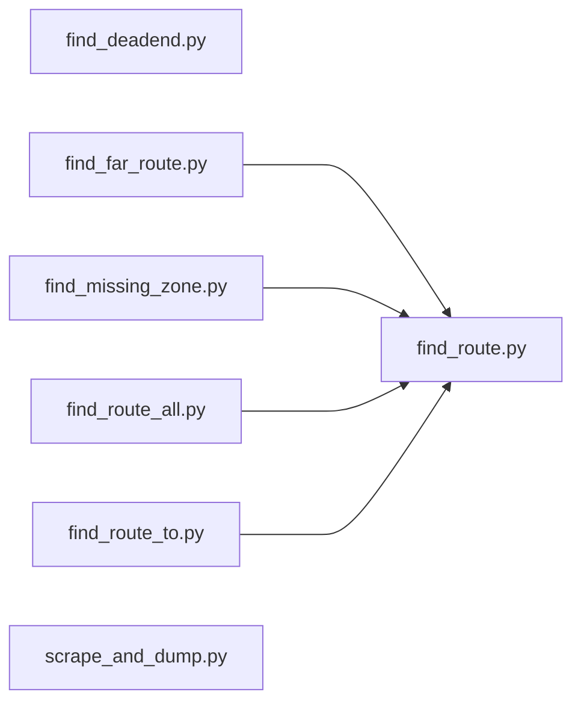

```mermaid
graph LR
	find_deadend[find_deadend.py]
	find_far_route[find_far_route.py] ---> find_route
	find_missing_zone[find_missing_zone.py] ---> find_route
	find_route[find_route.py]
	find_route_all[find_route_all.py] ---> find_route
	find_route_to[find_route_to.py] ---> find_route
	scrape_and_dump[scrape_and_dump.py]
```
