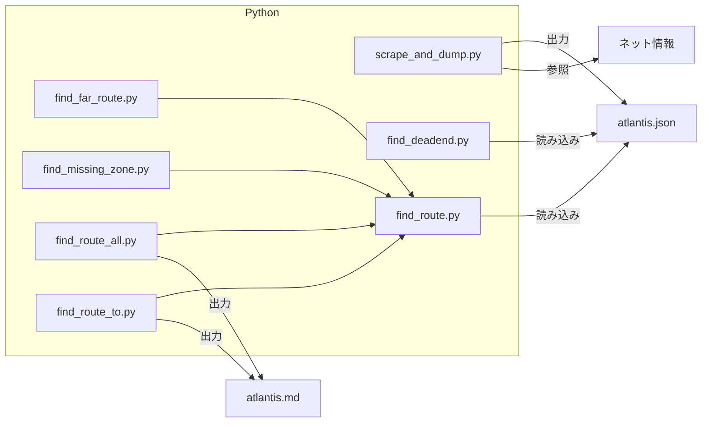

## 概要
「アトランチスの謎」のワープ構成を可視化

## ファイル構成


## 使い方
1. ネット情報を読み込みJSONファイル化
```
python3 scrape_and_dump.py
```
2. 可視化
2.1 行き止まりを検出
```
python3 find_deadend.py
```
2.2 最もワープを要するゾーンを探索
```
python3 find_far_route.py
```
2.3 到達できないゾーンを検出
```
python3 find_missing_zone.py
```
2.4 全ゾーンのつながりを可視化
```
python3 find_route_all.py
```
2.5 指定のゾーンへのつながりを可視化
```
python3 find_route_all.py zone limit
```
